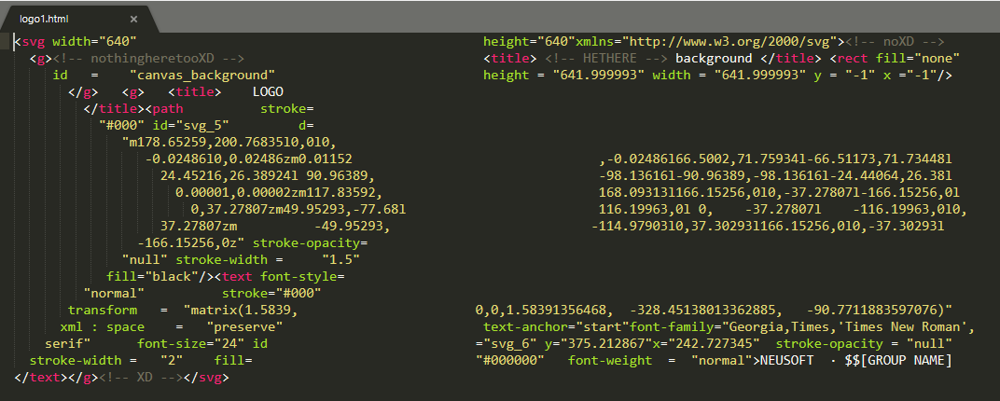
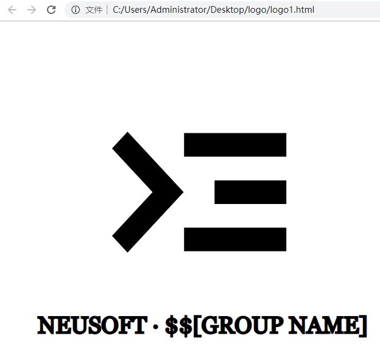

## 有关本LOGO的设计说明
> 本文档使用markdown语法编写

Hey guys! 我试着画了一下LOGO~大家可以一起看看提下意见XD 

- logo的主体是命令行的标志，代表我们coding的本质工作
> 说出来你们可能不信，这个标志是从“1110”演变过来的，那个“>”本来代表0，横线代表1。1110是二进制的“14”，代表我们组有14个人

- 两个文件均为svg格式，具有缩放不损失清晰度的优点

### logo1.html

我个人比较喜欢logo1，虽然看上去简单，但我觉得这个更具有创新性。logo1.html通过浏览器和文本编辑器均可以打开，并且均显示出主体logo：

> Open with SublimeText

> Open with Chrome

### logo2.html

logo2的图形相对复杂一些，加入了音符标志和【FXXK THE BUG】标志。

音符标志中，去除开始的变音符号和结尾的休止符，中间的四个音符按奇偶数算刚好是“1110”，也就是14，代表我们的人数。

## At Last

现在这个可以作为初稿，我个人也觉得设计依然显得有些单薄，我接下来会把这个项目放到gitHub上，欢迎大家PR！

Love you guys!

俊呈XD

